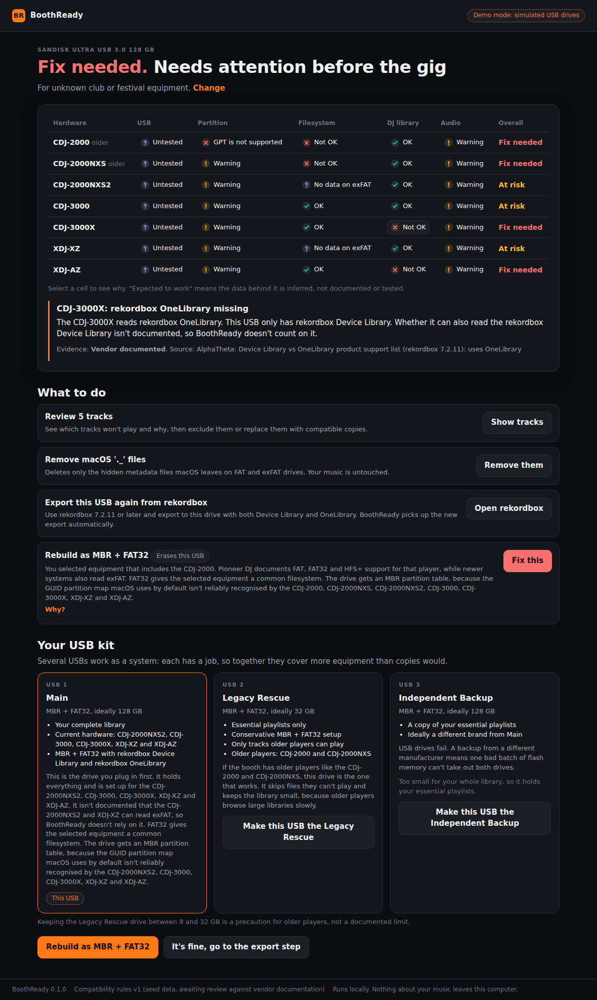

# BoothReady

Plug in your USB and BoothReady tells you whether it will work on the DJ equipment you're about to play, then fixes, prepares and verifies it until it does.

This repository holds the Phase 1 prototype from the product requirements: a Rust engine that reads a USB stick down to its partition table, a privileged helper that is the only part allowed to erase anything, a `boothready` command-line tool, and a Tauri 2 desktop app for macOS and Windows.



## Try it without a USB stick

The app and the CLI both have a demo mode that uses simulated drives, so you can walk through the whole flow on any machine.

```sh
# Command line
cargo build
./target/debug/boothready --demo /tmp/br demo init
./target/debug/boothready --demo /tmp/br demo insert sandisk-128
./target/debug/boothready --demo /tmp/br check sandisk-128
./target/debug/boothready --demo /tmp/br demo insert kingston-32
./target/debug/boothready --demo /tmp/br copy sandisk-128 kingston-32
./target/debug/boothready plan --library-gb 94 --essential-gb 20 \
    --drive "SanDisk Ultra:SanDisk:128" --drive "Kingston DT:Kingston:32"

# Desktop app in demo mode (Linux also needs the webkit2gtk-4.1 dev packages)
cd app && npm ci
BOOTHREADY_DEMO=1 npx tauri dev

# UI only, in a browser, against a mock generated from real engine output
cd app && npm run dev
```

The simulated 128 GB SanDisk is the PRD's acceptance scenario: GPT and exFAT from a Mac, with only a rekordbox Device Library. BoothReady fails it for the original CDJ-2000, flags OneLibrary as missing for the CDJ-3000X and XDJ-AZ, recommends MBR and FAT32, and plans a separate Legacy Rescue drive.

## Alpha builds

The Installers workflow builds a macOS app (universal, as a `.dmg`) and Windows installers (`.msi` and `.exe`). Run it from the Actions tab to get them as artifacts, or push a `v*` tag to also get a draft pre-release with the files attached. The workflow signs and notarises the macOS app and signs the Windows installers as soon as the repository secrets listed at the top of [`.github/workflows/release.yml`](.github/workflows/release.yml) exist; until then it builds unsigned, and each run reports which it did.

The builds aren't signed yet, so both systems warn before the first launch. On macOS, open the app with right-click and Open, or run `xattr -dr com.apple.quarantine /Applications/BoothReady.app`. On Windows, choose More info and then Run anyway.

To build an installer yourself on the machine it's for:

```sh
scripts/build-helper-sidecar.sh            # or: scripts/build-helper-sidecar.sh universal-apple-darwin
cd app && npm ci && npx tauri build --config src-tauri/tauri.release.conf.json
```

[`docs/FIELD-TEST.md`](docs/FIELD-TEST.md) walks through a first test with real sticks. When a drive is misread, **Save diagnostics** in the app's footer, or `boothready diagnose`, writes a report of how BoothReady and the OS each see the machine's drives. It holds no file names.

The release config ships `boothready-helper` next to the app's executable. A development build looks in the same place, which is `target/debug` once you've run `cargo build -p boothready-helper`, and `BOOTHREADY_HELPER` can point it somewhere else.

## What's here

| Path | What it does |
|---|---|
| `crates/boothready-core` | The engine. It parses partitions and filesystems from raw sectors, probes audio headers, reads rekordbox `export.pdb` and Engine DJ databases, evaluates the compatibility rules, plans multi-USB kits, builds MBR + FAT32 drives and verifies them. |
| `crates/boothready-core/data/ruleset.json` | Device profiles and target presets. Every claim has a support level and an evidence level. |
| `crates/boothready-platform` | Device discovery, watching and ejecting on Linux (sysfs), macOS (`diskutil`/`ioreg`) and Windows (storage IOCTLs, SetupAPI, CfgMgr32), plus the folder-backed demo platform. |
| `crates/boothready-helper` | The elevated helper. It takes a closed set of JSON requests and refuses to erase unless the drive still matches what the user confirmed. |
| `crates/boothready-cli` | The `boothready` command. |
| `app/` | The Tauri 2 desktop app with a TypeScript UI. |
| `docs/ARCHITECTURE.md` | How the pieces fit, the safety model and what still needs verifying. |

## Tests

```sh
cargo test                  # engine, platform, helper, CLI
cd app && npm run build && npm run screenshots   # full UI walkthrough in headless Chromium
```

On Linux the image tests use `sfdisk`, `sgdisk`, `mkfs.fat`, `mkfs.exfat`, `fsck.fat`, mtools and ffmpeg when they're installed, and skip themselves when they aren't. CI runs the engine and the app on Ubuntu, macOS and Windows.

## Status

The engine is tested against real rekordbox exports, ffmpeg-encoded audio and disk images built with the standard Linux tools. The macOS and Windows device backends run their parsers in tests and enumerate the CI runners' own disks, but haven't touched a real USB stick yet. The compatibility rules cite a vendor document or a forum report for every documented claim and mark everything else as inferred, but none of them has been tested on hardware yet, and the app says so on every screen. [`docs/ARCHITECTURE.md`](docs/ARCHITECTURE.md#what-still-needs-verifying) lists what has to happen before anyone relies on this at a gig.
